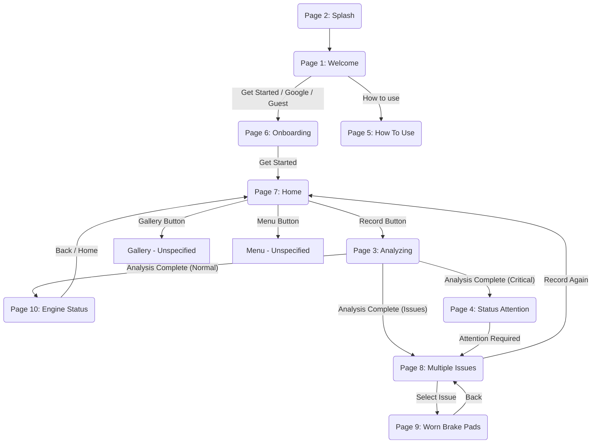

# Screen Flow & Navigation

## Flow Chart

## Screen Transitions

1.  **Initialization**:

    - **Splash (Page 2)**: App launch. Automatically transitions to **Welcome**.

2.  **Authentication / Onboarding**:

    - **Welcome (Page 1)**: User chooses auth method or views tutorial.
      - Action: `HowToUseButton` -> **How To Use (Page 5)**.
      - Action: `GoogleAuthButton` / `GuestAuthButton` -> **Onboarding (Page 6)**.
    - **How To Use (Page 5)**: Informational. Back navigation leads to **Welcome**.
    - **Onboarding (Page 6)**: Explains value prop.
      - Action: `GetStartedButton` -> **Home (Page 7)**.

3.  **Main Workflow (Diagnostics)**:

    - **Home (Page 7)**: Central hub.
      - Action: `RecordButton` -> **Analyzing (Page 3)**.
    - **Analyzing (Page 3)**: Temporary state.
      - Automatic Transition -> **Results** (depending on outcome).

4.  **Results & Details**:
    - **Engine Status (Page 10)**: "Green" state. No issues found.
    - **Status Attention (Page 4)**: "Red" state. Critical warning.
      - Action: `AttentionRequiredButton` -> **Multiple Issues** (or details).
    - **Multiple Issues (Page 8)**: List of detected problems.
      - Action: Select Issue -> **Worn Brake Pads (Page 9)** (Detail View).
      - Action: `ActionButton` (Record Again) -> **Home**.
    - **Worn Brake Pads (Page 9)**: Specific issue detail.
